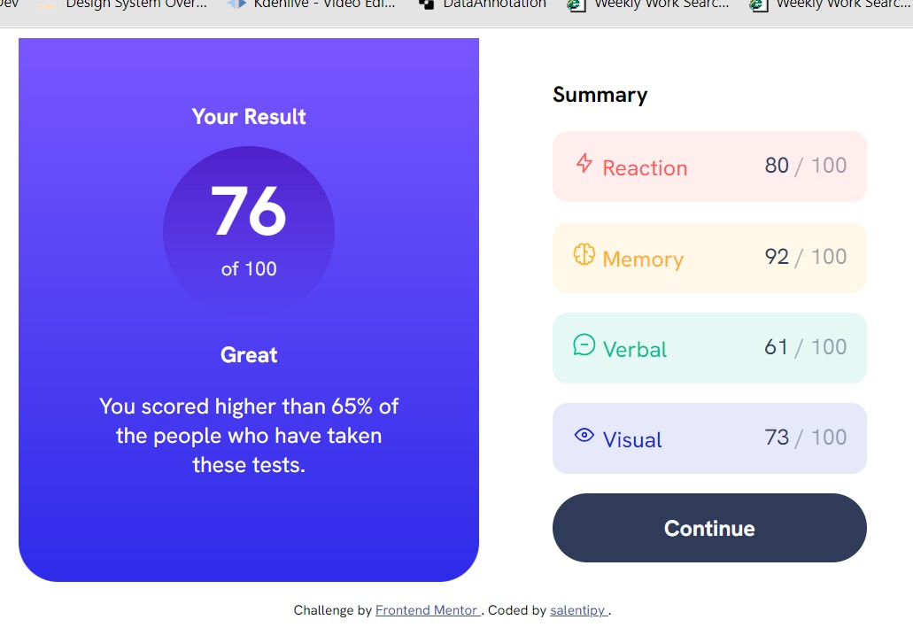
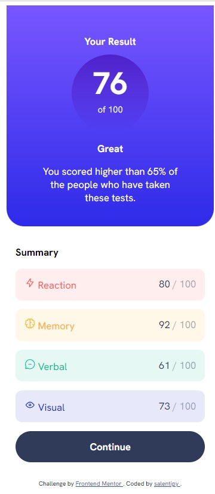

<!-- @format -->

# Frontend Mentor - Results summary component solution

This is a solution to the [Results summary component challenge on Frontend Mentor](https://www.frontendmentor.io/challenges/results-summary-component-CE_K6s0maV). Frontend Mentor challenges help you improve your coding skills by building realistic projects.

## Table of contents

- [Overview](#overview)
  - [The challenge](#the-challenge)
  - [Screenshot](#screenshot)
  - [Links](#links)
- [My process](#my-process)
  - [Built with](#built-with)
  - [What I learned](#what-i-learned)
  - [Continued development](#continued-development)
  - [Useful resources](#useful-resources)
- [Author](#author)

## Overview

### The challenge

Users should be able to:

- View the optimal layout for the interface depending on their device's screen size
- See hover and focus states for all interactive elements on the page
  ~~- **Bonus**: Use the local JSON data to dynamically populate the content~~

### Screenshot

### Links

- Solution URL: [Add solution URL here](https://your-solution-url.com)
- Live Site URL: [Add live site URL here](https://your-live-site-url.com)

## My process

### Built with

- Semantic HTML5 markup
- CSS custom properties
- Flexbox
  ~~- CSS Grid~~
- Mobile-first workflow

### What I learned

I've been trying to create sites as responsive as possible. I couldn't quite work this one out in an incrementally responsive way, but I did use the media query properly, I think. I also realize that it probably would've been easier/better to build this with grid instead of flexbox, but I was experimenting to see how I could work it out with flex.

This project challenged me some with colors: gradients and opacities - things I haven't worked with very much up to this point.

This was also my first attempt at using BEM as a naming convention, so it's quite possible I did it incorrectly! Still learning everything, it seems. :)

### Continued development

My aim is to continue building a strong foundation in HTML and CSS then move to JavaScript. Along the way, I will be learning more about Figma, Git, VS Code, and any other tools I come across that are useful. At some point, I plan to start working with some frameworks, but I want a more solid foundation first. Frontend Mentor has helped tremendously with projects, and Kevin Powell's videos on YouTube are amazingly helpful!

### Useful resources

- [Kevin Powell](https://www.youtube.com/@KevinPowell) - As I said above, Kevin's videos have been extremely helpful. They're informative, interesting, and well-produced. I inted to keep devouring them and recommend them to anyone in this same web dev journey.
- [The Markdown Guide](https://www.markdownguide.org/) - This is where I get all of my markdown information from. There is good info there and a nice cheat sheet, as well.
- [PX converter](https://nekocalc.com/px-to-rem-converter) - I use this resource a LOT trying not to use px anymore than I have to. I've learned/been told that rem is the best unit, overall, so I try to stick to that as much as possible.
- [Dillinger](https://dillinger.io/) - free resource to view markdown files
- [Lorem Picsum](https://picsum.photos/) - wonderful free image placeholder service

## Author

- You can find me as "salentipy" on all social media sites.
